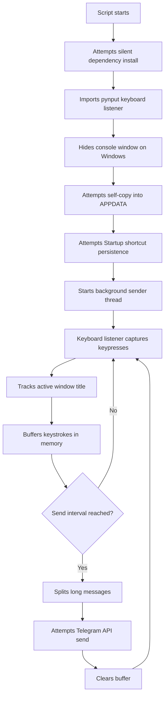

# ◆ Loger.py

> ⚠️ **Educational purpose only.**  
> This repository is documented strictly for cybersecurity awareness, malware-analysis practice, and defensive learning in an authorized lab. Do not use it to monitor, collect, intercept, persist, or transmit anyone's keystrokes or system activity without clear written permission.

<!-- Add your demo gif here:  -->

## ✦ 「Purpose」

`loger.py` is a Python script that demonstrates how a Windows-focused keystroke logger can capture keyboard input, track foreground window titles, buffer captured text, and attempt periodic delivery through the Telegram Bot API.

This README frames the project for **educational purpose only**, defensive review, and controlled lab analysis. It is not a deployment guide for unauthorized monitoring.

## ⚡ 「Educational Scope」

| ◆ Area | ▸ Details |
|---|---|
| 🎯 Intended use | Educational purpose only, malware-analysis training, defensive awareness |
| 🧪 Safe environment | Isolated Windows VM or disposable lab machine only |
| 🚫 Not allowed | Unauthorized surveillance, credential theft, persistence abuse, stealth deployment |
| 🔐 Data handling | Never collect real user data, passwords, private messages, or third-party activity |
| 📌 File analyzed | `loger.py` |

> ⚠️ **Educational purpose only:** running keylogging software on systems or accounts you do not own or do not have explicit permission to test may be illegal.

## ⟡ 「How It Works」

## ► 「Technical Breakdown」

| ✦ Component | ⚙️ Behavior |
|---|---|
| `install_packages()` | Attempts to silently install `pynput` and `requests` with `pip` |
| `send_to_telegram(message)` | Sends buffered text to Telegram using `TELEGRAM_BOT_TOKEN` and `TELEGRAM_CHAT_ID` |
| `split_message(text)` | Splits large messages to stay under the configured message length |
| `get_active_window()` | Attempts to read the current foreground window title using `win32gui` |
| `on_press(key)` | Captures printable keys and maps special keys like Enter, Tab, Backspace, arrows, and function keys |
| `send_logs()` | Runs in a background thread and sends buffered logs every `SEND_INTERVAL` seconds |
| `add_to_startup()` | Attempts to create a Windows Startup shortcut named `WindowsHost.lnk` |
| `self_persist()` | Attempts to copy itself into `%APPDATA%\WindowsHost\wuhost.exe` and relaunch |
| `hide_console()` | Attempts to hide the console window via Windows APIs |
| `main()` | Starts persistence behavior, sender thread, and keyboard listener |

## ⚠️ 「Critical Warning」

> This code contains behaviors commonly associated with malware: keystroke capture, stealth, persistence, hidden execution, and remote exfiltration.  
> Use it for **educational purpose only** inside an isolated lab.

> Do not run this on a personal daily-use machine, workplace device, school device, shared computer, or any system containing real user data.

## ◆ 「Safe Lab Use」

| ✅ Step | 🧪 Educational-only action |
|---|---|
| 1 | Review the code statically before execution |
| 2 | Use an isolated Windows virtual machine with no personal accounts logged in |
| 3 | Disconnect the VM from sensitive networks |
| 4 | Keep `TELEGRAM_BOT_TOKEN` and `TELEGRAM_CHAT_ID` as placeholders unless you are analyzing API behavior in a controlled lab |
| 5 | Do not type real credentials, private messages, personal data, or third-party information |
| 6 | Remove persistence artifacts after analysis |
| 7 | Destroy or revert the VM snapshot after testing |

## ✦ 「Configuration Fields」

| 🔧 Setting | 📌 Meaning |
|---|---|
| `TELEGRAM_BOT_TOKEN` | Placeholder for a Telegram bot token |
| `TELEGRAM_CHAT_ID` | Placeholder for the destination chat ID |
| `SEND_INTERVAL` | Time window between attempted sends, currently `20` seconds |
| `MAX_MSG_LEN` | Maximum message chunk size, currently `4000` characters |

> ⚠️ **Educational purpose only:** do not configure this script to receive real keystrokes from real users.

## ⟡ 「Runtime Behavior」

| ⚡ Behavior | 📍 Detail |
|---|---|
| Platform focus | Windows-oriented |
| Keyboard capture | Uses `pynput.keyboard.Listener` |
| Window context | Attempts active window capture through `win32gui` |
| Delivery method | Telegram Bot API via `requests.post()` |
| Persistence method | Startup shortcut plus copied executable/script path |
| Console visibility | Attempts to hide the console window |
| Error handling | Broad `try/except` blocks suppress failures |

## ► 「Defensive Indicators」

| 🛡️ Indicator | 🔎 Value |
|---|---|
| Startup shortcut | `%APPDATA%\Microsoft\Windows\Start Menu\Programs\Startup\WindowsHost.lnk` |
| Copied location | `%APPDATA%\WindowsHost\wuhost.exe` |
| Temporary script | `%TEMP%\tmp.vbs` |
| Network endpoint | `https://api.telegram.org/bot.../sendMessage` |
| Suspicious imports | `pynput`, `requests`, `ctypes`, `shutil`, `subprocess`, `threading` |

## ⚡ 「Detection Notes」

| ✦ Signal | ▸ Defensive interpretation |
|---|---|
| Hidden console call | Possible stealth behavior |
| Startup folder shortcut | Persistence attempt |
| Keystroke listener | Input capture behavior |
| Telegram API traffic | Possible data exfiltration channel |
| Silent dependency install | Evasion of visible setup steps |
| Broad exception suppression | Failure hiding and reduced observability |

## ◆ 「Cleanup Checklist」

| 🧹 Item | ✅ Action |
|---|---|
| Startup shortcut | Remove `WindowsHost.lnk` from the Windows Startup folder |
| Copied payload | Remove `%APPDATA%\WindowsHost\wuhost.exe` if present |
| Temporary VBS | Check `%TEMP%` for leftover `tmp.vbs` |
| Running process | Stop any unexpected Python or copied executable process |
| Network access | Revoke any test bot token used in a lab |
| VM state | Revert to a clean snapshot |

## ⚠️ 「Disclaimer」

This project is for **educational purpose only**.

This project is for **educational purpose only**.

This project is for **educational purpose only**.

The code demonstrates concepts that may be useful for understanding how keyloggers, persistence, and exfiltration mechanisms work from a defensive cybersecurity perspective. It must not be used for unauthorized access, surveillance, credential collection, privacy invasion, or activity monitoring.

You are responsible for following all applicable laws, rules, platform policies, and ethical testing requirements. Only analyze or execute this code in systems you own or have explicit permission to test.

## ✦ 「Credits」

| ◆ Role | ▸ Credit |
|---|---|
| Author | [Stein](https://github.com/stein-exe) |
| GitHub | [stein-exe](https://github.com/stein-exe) |
| Telegram | [Stein](https://t.me/rejerk) |
| Telegram Group | [keped](https://t.me/keped) |
